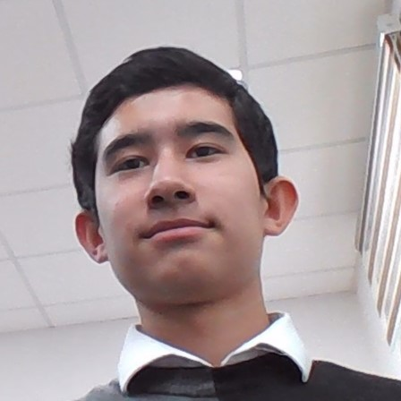

# CV

## Asror, Abdulazizov

## Contacts
<ul style="list-style-position:inside;">
	<li>Phone: +998(90) 113-45-25</li>
	<li>Telegram: <a href="@asror_abdulaziziov">@asror_abdulaziziov</a></li>
	<li>Email: <a href="#">asror6857@gmail.com</a></li>
	<li>Discord: Double_bow1</li>
</ul>

## Summary

I am intersted in Front-end developing. In school I was diligent student, but I decidea to brek the frame and web-developing was best path to my dream. There I can do anything I want: make new ideas, solve problems and etc

And now my goal is to become front-end developer, who can do interactive web-sites ...

Self-motivated, Disceplined, Ready to learn.

## Skills

##### Languages
* HTML
* CSS,SCSS
* JavaScript(ES6)

##### Version Control System
* Git

##### Frameworks/Libraries
* Bootstrap
* SASS/SCSS

##### Tools
* VS Code
* Github
* Figma
* Google
* Chrome DevTools...

##### Platforms
* Windows

## Code examples
* Codewars [@Double_bow](https://www.codewars.com/users/Doublebow1)
* Github [@Double_bow](https://github.com/Doublebow1)

## Experience (student projects)

* [Burger shop](https://github.com/Doublebow1/Burger) made in ITlogia intensive
* [Online course](https://github.com/Doublebow1/grok) made with my friend [Bryan](https://github.com/bobov1190)

## Education

* Acdemic Lyceum Tutin Politechnic Univercity in Tashkrnt
* Online learning (youtube, online courses, ...)
* [RSSchool](https://rs.school/) JS2024Q1  

## English

My english level is between A2+ and B1
